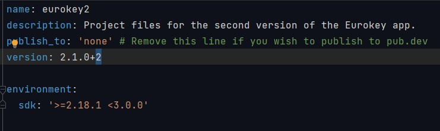
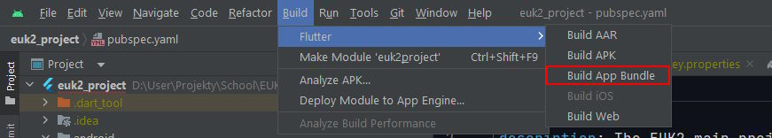

# App Build Guide

This guide helps with building  the app so that it can be published to **Google Play/App store**.

> ❗This guide assumes you are using Android Studio.

## Table of Content

[1. Build for Google Play](#build-for-google-play)

## Build for Google Play

In this section you will learn how to build an App Bundle (.aab) for publishing to Google Play.

1. Go to the file **euk2_project\pubspec.yaml** and increment the build number after the version.

\
This is because Google Play requires this number to be unique for each build.

    >❗If Google Play Console throws an error of type "*Version code X has already been used*" try changing this number to a different one until it works.

2. In the Console for the project run `flutter run`, `fluter build appbundle` or `flutter build apk` so that the version code gets properly updated.

3. In Android Studio go to and press **Build/Flutter/Build App Bundle**

4. After the build finishes your .aab file will in the**euk2_project\build\app\outputs\bundle\release** folder.

Now you can copy the App Bundle file into Google Play Console.
