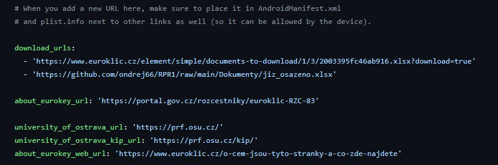
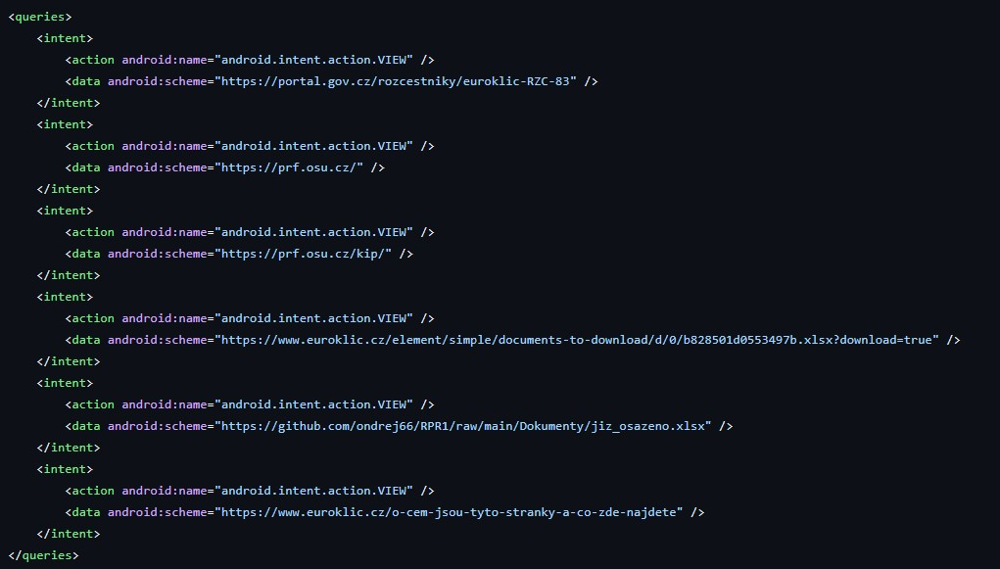
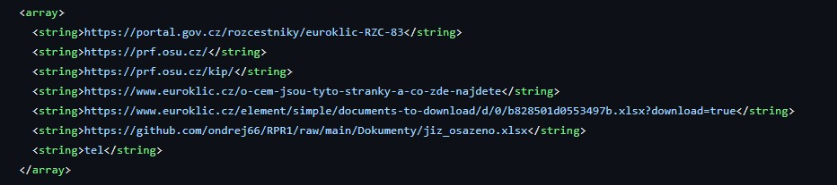
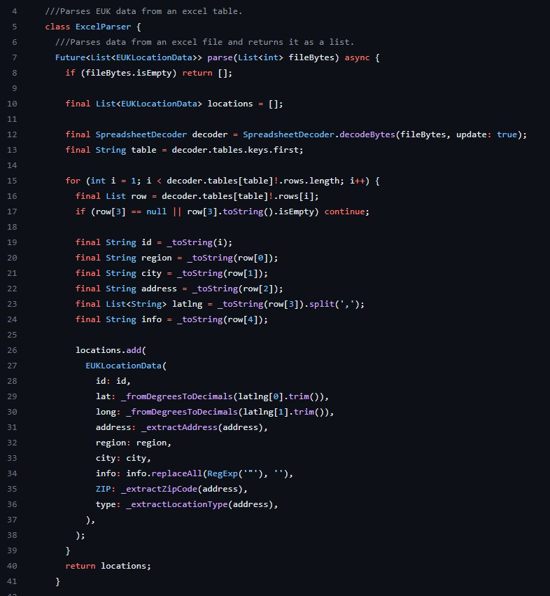

# Modification Guide

This guide helps with making adjustments to the EUK2 project. You will need a text editor/IDE for the steps below.

## Table of Contents

- [Modification Guide](#modification-guide)
  - [Table of Contents](#table-of-contents)
  - [1. Modify download URLs for locations](#1-modify-download-urls-for-locations)
  - [2. Edit excel parsing](#2-edit-excel-parsing)

## 1. Modify download URLs for locations

Follow this section if you wish to adjust URLs, from which the app downloads [the excel file](https://github.com/ondrej66/RPR1/raw/main/Dokumenty/jiz_osazeno.xlsx) that contains Eurokey location data.

1. Open the file **euk2_project/assets/url_addresses.yaml**. This file contains all URL addresses the app can access.

2. Add/Remove/Modify the `download_urls` list of urls.

   >❗ The top-most url is the address the app tries to download from first. If it fails, it moves to the one lower on the list.

3. Open the file **euk2_project/android/app/src/main/AndroidManifest.xml**.

4. Add/Remove/Modify an `intent` block under the `queries` group with the wanted URL address.

5. Open the file **euk2_project/ios/Runner/Info.plist**.

6. At the bottom of the file under the `array` group add/remove/modify your wanted URL address.

And with that the URL modification should be successful.
> ❗The order of entries in AndroidManifest.xml and Info.plist doesn't matter.

## 2. Edit excel parsing

This section helps you with understanding how the app parses the excel file. Use this if Eurokey has made changes to their excel file and the app cannot recognize it.

The excel parsing is handled in the file **euk2_project/lib/features/location_data/excel/loading/excel_parser.dart**

The main function `parse()` (line 7) decodes and parser all rows of the excel file in a for loop (line 15)
\
The variable `row` (line 16) represents a single row of the excel file. It's an array of *dynamic* types each representing a single cell of the excel row.

**Lines 19-24** represent the different data types in `string` format (`id, region, city, address, latlng, info`). Here you edit what type of data is read from which column.
>❗In the picture you can see that *region* is from *column 0*, *city* from *column 1* and so on.
