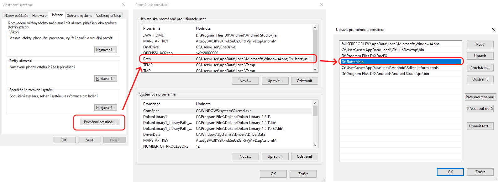
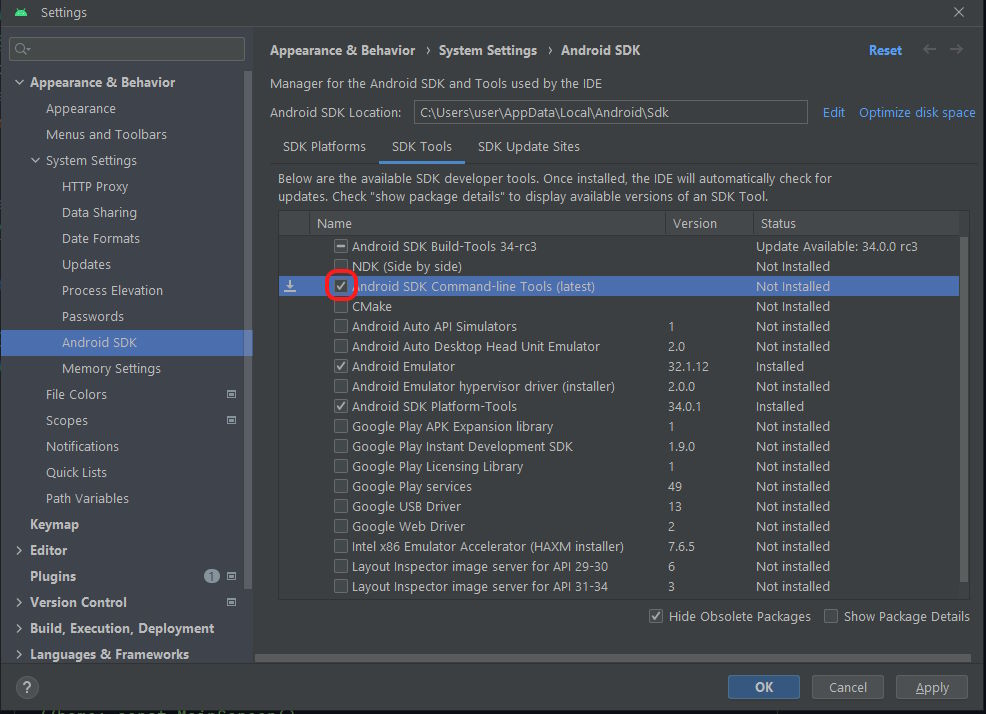
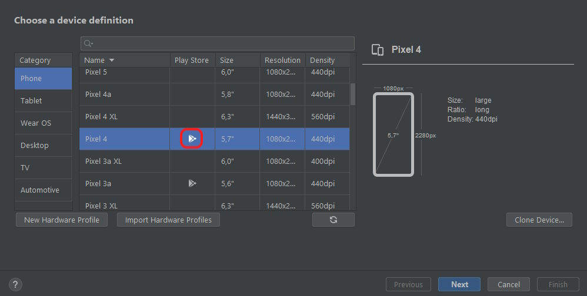
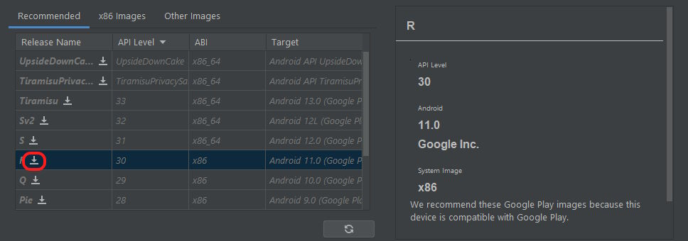

# About

This guide helps you with setting up the EuroKey 2.0 project on your machine (Windows, MAC).
> ❗ Make sure to have Java (JRE & JDK) installed on your computer.

# 1. Flutter Install

This section shows you how to install FLutter and Dart onto your computer.
\
For more information visit the [Official Flutter site](https://docs.flutter.dev/get-started/install).

## For Windows

1. Download [Flutter SDK](https://storage.googleapis.com/flutter_infra_release/releases/stable/windows/flutter_windows_3.7.12-stable.zip).

2. Store ZIP content anywhere on your computer.

> ❗ Your path must not contain any special characters or spaces.
> \
> ❗ Your path must not require elevated privileges.

3. Add flutter to your path by going to **Edit environment variables** -> **Enviromental variables** -> **PATH** -> **add** path to flutter/bin as a new variable.

\
4. Run `flutter doctor` in console to verify installation.

## For MAC

1. Make sure you have xCode installed.

2. Run `xcode-select --install` in the terminal to install command line tools.

3. Make sure you have [Homebrew](https://brew.sh/) installed. This is the easiest way to install flutter on MacOS.

4. Run `brew install --cask flutter` in the terminal to install flutter and add it to the PATH.

---

# 2. Android Studio Install

This section explains how to prepare the Android Studio IDE for flutter development.

## For Windows & MAC

1. Download & install the latest version of [Android Studio](https://developer.android.com/studio).

2. When Android Studio asks you, make sure to install **Android SDK**.

> ❗ You can also later install Android SDK by going into **Settings -> Appearance & Behaviour -> System Settings -> Android SDK** and selecting the version you want there (Android 11).

3. **(MAC ONLY)**
\
To register Android SDK in the OS run `cd $HOME`, then `nano .zshrc` in the terminal.
\
Now write `export ANDROID_HOME=$Android SDK Location$` and press **CONTROL+X** then hit **Y** and lastly press **ENTER**.
\
Now restart the terminal and type in `echo $ANDROID_HOME` to check if Android SDK has been registered successfully.

> ❗ Android SDK location can be found in Android Studio **Settings -> Appearance & Behaviour -> System Settings -> Android SDK**.

4. In Android Studio, go to **Settings -> Appearance & Behaviour -> System Settings -> Android SDK**, here, select tab **SDK Tools** and make sure that **Android SDK Command-line Tools (latest)** is installed.

5. Run `flutter doctor --android-licenses` in console and accept all licenses with `y`.

> ❗ if the error 'JAVA_HOME is set to an invalid directory' shows up, make sure you have a system variable in **Edit environment variables** -> **Enviromental variables** JAVA_HOME set to the path of your JDK.

6. (MAC Only)
\
If flutter doctor says CocoaPods is not installed, open the terminal and run `brew install cocoapods`.

7. In Android Studio go to **settings -> plugins** and make sure you have the **FLutter** and **Dart** packages on their latest versions.

# 3. Project Setup

This section explains how to get your own copy of the project files onto your computer.

## For Windows & MAC

1. Clone the [EuroKey 2.0 Repository](https://github.com/ondrej66/RPR1) from GitHub onto your computer.

> ❗ The team uses [GitHub Desktop](https://desktop.github.com/), but you are can use anything tha clones Git repositories (Git, Android Studio's built-in source control).

2. For the most up-to-date project version, make sure to switch branch to **develop**.

3. Open project in Android Studio.

4. In project's console run `pub get` to update all dependencies for your machine.

>❗ Alternatively you can open pubspec.yaml from project root and click "pub get" on the top right.

# 4. Run on a real device

This section explains how to test the project on a real device.

## For Android

1. Enable [Developer options](https://developer.android.com/studio/debug/dev-options) on your Android device.

2. Enable USB debugging for the device.

3. Connect your device to the computer, wait until Android Studio recongnizes it after which you can hit "Run" to start the app on your device.

> ❗ If the error "The supplied javaHome seems to be invalid. I cannot find the java executable" shows up, delete **%Path to Android Studio%/jre** folder and restart Android Studio.

# 5. Run on an emulator

This section explains how to test the project on a simulated device.

## For Android

1. In Android Studio open the **Device Manager** (Right side of the screen or View -> Tool Windows -> Device Manager).

2. Under the tab **Virtual** hit **Create Device**.

3. Select the device model you want. It's better if it has Play Store support, so Google maps can work properly.

4. Select OS for the device. Download it with the download icon.

1. Name your device and click **Finish**. It will now show up in the device manager.

2. Hit Play on the device in the Device Manager. This will start up the emulator and allow the emulated device to be detected for app testing.

## For iOS

1. Open **Simulator.app**.
2. The default iOS device boots when the simulator starts. Android studio should now detect that device for testing the app.
